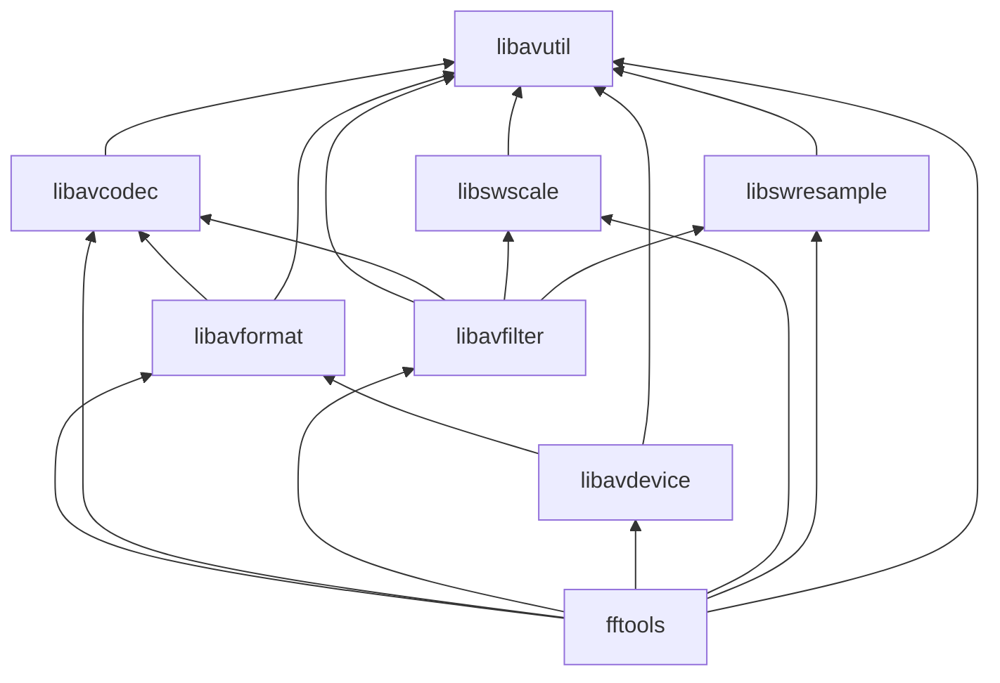

# Dependency Graph

Verified against upstream library layout and typical link order (libavutil is the foundation; higher libraries depend downward).

## Rules of thumb

| Library | May depend on |
|---------|----------------|
| libavutil | (none of the other FFmpeg libs) |
| libavcodec | libavutil |
| libavformat | libavutil, libavcodec |
| libavfilter | libavutil, libavcodec; optionally libswscale, libswresample |
| libavdevice | libavutil, libavformat |
| libswscale | libavutil |
| libswresample | libavutil |
| fftools | all of the above as needed |

Architecture-specific code (x86/, arm/, aarch64/, neon, SSE, AVX, etc.) lives *inside* the libraries that need it and is selected at configure/build time.

*Source: FFmpeg tree layout and public headers.*
